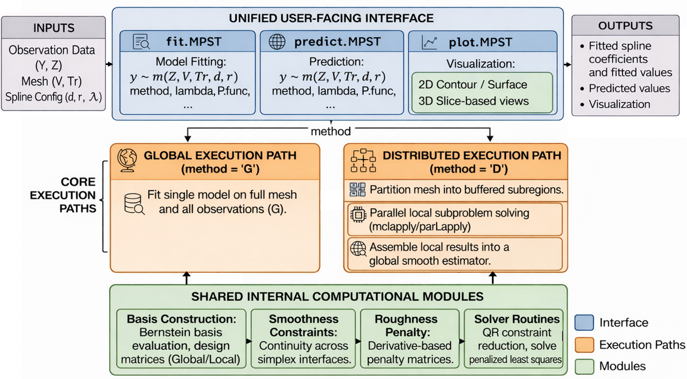
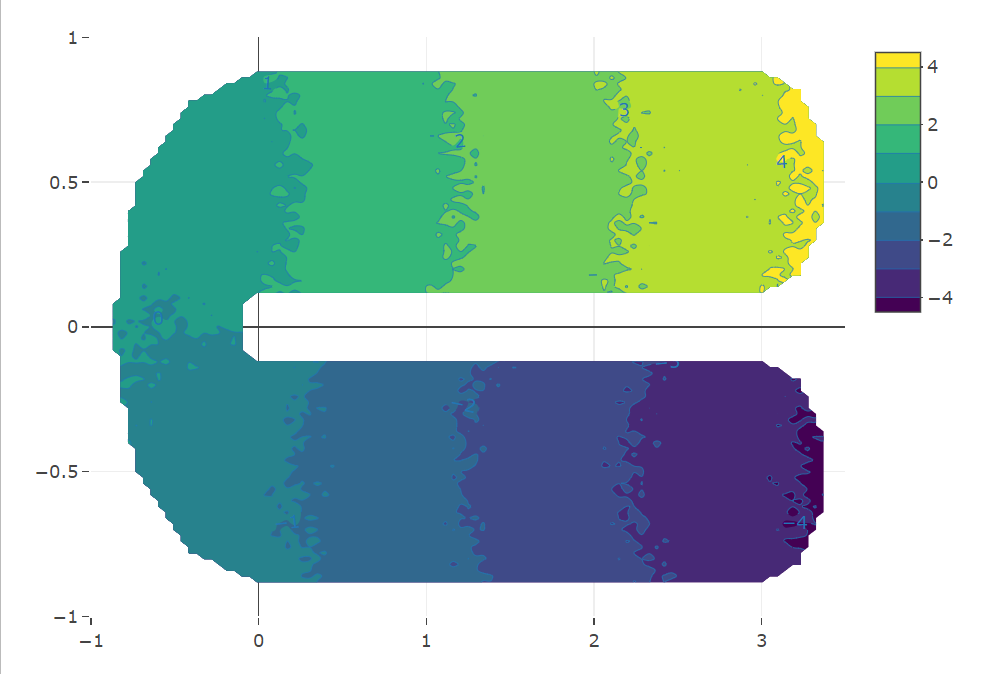
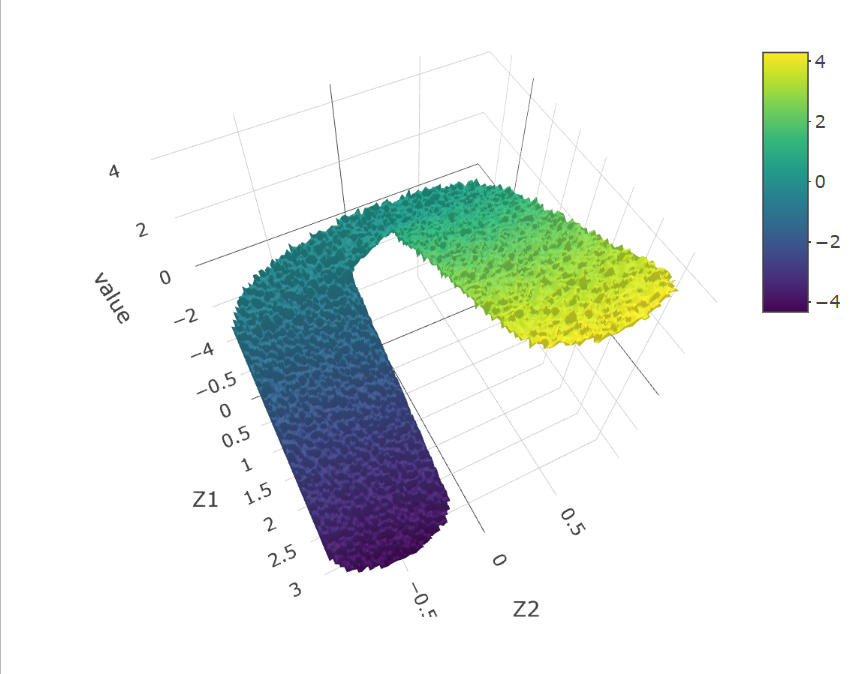
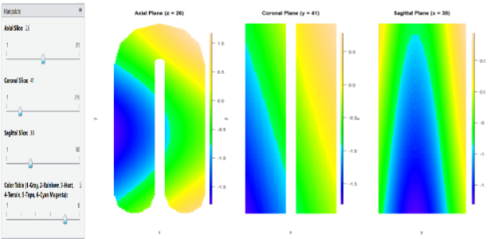
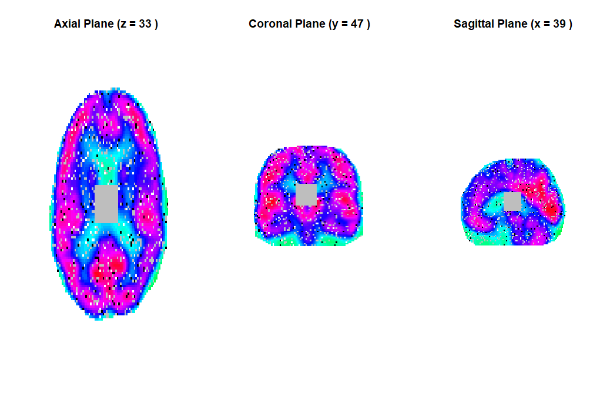

# MPST

**MPST** is an R package for **Multivariate Penalized Splines over Triangulations**. It provides a unified framework for smoothing, denoising, prediction, and visualization on complex two-dimensional and three-dimensional domains.

The package is designed for nonparametric regression and function estimation when observations are noisy, spatially indexed, and located on regular or irregular domains. MPST uses triangulation-based spline representations to respect complex geometry and supports both global learning for moderate-sized problems and distributed learning for larger-scale applications.

## Overview

MPST implements penalized spline smoothing over user-supplied triangulations. In two dimensions, the domain is represented by triangles; in three dimensions, it is represented by tetrahedra. The package combines:

* Bernstein polynomial spline basis construction
* Explicit smoothness constraints across simplex interfaces
* Derivative-based roughness penalization
* Global penalized spline fitting
* Distributed learning through domain decomposition
* Prediction at user-specified locations
* Built-in visualization for 2D and 3D fitted functions

This package was developed as part of my Ph.D. research in Statistics at George Mason University. The package and accompanying manuscript are being prepared for submission to the *Journal of Statistical Software*.

## MPST Package Workflow

The MPST package provides a unified user-facing interface for model fitting, prediction, and visualization through `fit.MPST()`, `predict.MPST()`, and `plot.MPST()`. Internally, the package supports both global and distributed execution paths, while sharing computational modules for basis construction, smoothness constraints, roughness penalty construction, and solver routines.



## Key Features

* **2D and 3D smoothing:** Supports bivariate and trivariate domains using triangle-based and tetrahedron-based meshes.
* **Irregular domain support:** Uses triangulations to represent non-rectangular, non-convex, and geometrically complex domains.
* **Global learning:** Fits a single penalized spline model over the full triangulated domain.
* **Distributed learning:** Partitions the domain into subregions, fits local models in parallel, and assembles the results into a globally smooth estimator.
* **Automatic smoothing parameter selection:** Supports generalized cross-validation over a user-supplied grid of smoothing parameters.
* **Prediction workflow:** Evaluates fitted models at new spatial locations or regular plotting grids.
* **2D visualization:** Provides contour and surface plots for fitted functions.
* **3D visualization:** Provides slice-based views for inspecting fitted values in three-dimensional domains.
* **Research software design:** Provides an end-to-end workflow for modeling, prediction, visualization, simulation studies, and scalable computation.

## Example Visualizations

### 2D Irregular Domain Example

MPST supports smoothing and visualization over irregular two-dimensional domains, such as horseshoe-shaped regions.



*Contour visualization of a fitted function over a two-dimensional horseshoe-shaped domain.*



*Surface visualization of a fitted function over a two-dimensional horseshoe-shaped domain.*

### 3D Slice-Based Visualization

For three-dimensional domains, MPST supports slice-based visualization, which is useful for inspecting fitted functions or imaging-style data across axial, coronal, and sagittal planes.



*Slice-based visualization for a fitted function on a three-dimensional horseshoe-shaped domain.*



*Slice-based visualization for three-dimensional brain PET imaging-style data.*

## Code Samples to Review

For reviewers or employers interested in representative programming samples, I recommend reviewing:

1. **Model fitting and prediction functions** in the `R/` directory, especially functions related to `fit.MPST()`, `predict.MPST()`, and the global/distributed fitting workflows.
2. **Distributed learning components** that implement domain decomposition, local model fitting, coefficient assembly, and global smoothness projection.
3. **Basis, smoothness, and penalty construction functions** that implement the core numerical components of the MPST methodology.
4. **Computational routines in `src/`**, which demonstrate lower-level implementation for numerical efficiency.
5. **Documentation in `man/`**, which shows how the package functions are organized and documented for R users.

These components demonstrate experience with statistical programming, R package development, numerical methods, matrix computation, reproducible research software, and scalable analytical workflows.

## When to Use MPST

MPST is useful when data are observed over spatial domains with complex geometry, such as:

* Irregular two-dimensional spatial regions
* Non-convex domains such as horseshoe-shaped regions
* Three-dimensional point-cloud or imaging domains
* Biomedical and medical imaging data
* Large-scale spatial or geometric datasets
* Smoothing and denoising problems where domain geometry should be respected

The package is especially useful when regular-grid smoothers or standard tensor-product smoothers may not adequately respect the boundary or geometry of the domain.

## Installation

MPST is currently under active development. The development version can be installed from GitHub:

```r
# install.packages("remotes")
remotes::install_github("ycwang179/MPST")
```

After installation, load the package with:

```r
library(MPST)
```

The package is being prepared for submission to the *Journal of Statistical Software*. CRAN installation instructions will be added if the package becomes available on CRAN in the future.

## Basic Workflow

A typical MPST workflow consists of:

1. Preparing the response vector and spatial coordinates
2. Providing a triangulation through vertices and simplex indices
3. Fitting a global or distributed MPST model
4. Predicting fitted values at new locations
5. Visualizing the estimated function

The main user-facing functions are:

* `fit.MPST()` for model fitting
* `predict.MPST()` for prediction
* `plot.MPST()` for visualization

## Main Inputs

The main inputs used by MPST are:

* `Y`: response vector
* `Z`: matrix of observation coordinates
* `V`: matrix of mesh vertices
* `Tr`: element matrix defining triangles in 2D or tetrahedra in 3D
* `d`: polynomial degree of the spline basis
* `r`: smoothness order across simplex interfaces
* `lambda`: roughness penalty parameter or candidate grid
* `method`: `"G"` for global learning or `"D"` for distributed learning

## Example 1: 2D Global Learning

The following example fits a global MPST model on a two-dimensional square-domain dataset.

```r
library(MPST)

data(ex_square_train)

fit.g <- fit.MPST(
  y ~ m(Z, V, Tr, d = 3, r = 1),
  data = ex_square_train$m1$sigma01$tri50,
  method = "G",
  lambda = 10^seq(-6, 6, by = 0.5)
)

fit.g
```

Here, `method = "G"` fits the global MPST estimator using all observations and the full triangulation.

## Example 2: 2D Prediction

After fitting a model, prediction can be performed on a regular evaluation grid.

```r
data(ex_square_pred)

pred.g <- predict.MPST(
  y ~ m(Z, V, Tr, d = 3, r = 1),
  data = ex_square_train$m1$sigma01$tri50,
  data.pred = ex_square_pred$m1$sigma01$tri50,
  method = "G",
  lambda = 10^seq(-6, 6, by = 0.5)
)

pred.g
```

## Example 3: 2D Visualization

For two-dimensional domains, MPST supports both contour and surface visualization.

```r
plot(fit.g, mview = "contour")
plot(fit.g, mview = "surface")
```

These plots are useful for inspecting the estimated function over the triangulated domain.

## Example 4: 3D Global Learning

MPST also supports trivariate smoothing on tetrahedral meshes. The following example fits a global MPST model on a three-dimensional cube-domain dataset.

```r
library(MPST)

data(ex_cube_train)

fit.g3d <- fit.MPST(
  y ~ m(Z, V, Tr, d = 5, r = 1),
  data = ex_cube_train$tet48,
  method = "G",
  lambda = 10^seq(-6, 6, by = 0.5)
)

fit.g3d
```

In this example, the spatial domain is represented by a tetrahedral mesh, and the fitted function is defined over a three-dimensional domain.

## Example 5: 3D Prediction

Prediction in three dimensions follows the same formula-based interface.

```r
data(ex_cube_pred)

pred.g3d <- predict.MPST(
  y ~ m(Z, V, Tr, d = 5, r = 1),
  data = ex_cube_train$tet48,
  data.pred = ex_cube_pred$tet48,
  method = "G",
  lambda = 10^seq(-6, 6, by = 0.5)
)

pred.g3d
```

## Example 6: 3D Slice-Based Visualization

For three-dimensional domains, MPST supports slice-based visualization. The fitted model can be evaluated on a user-defined 3D grid and displayed through orthogonal slices.

```r
xg <- seq(min(fit.g3d$V[, 1]), max(fit.g3d$V[, 1]), length.out = 50)
yg <- seq(min(fit.g3d$V[, 2]), max(fit.g3d$V[, 2]), length.out = 50)
zg <- seq(min(fit.g3d$V[, 3]), max(fit.g3d$V[, 3]), length.out = 50)

Zgrid.custom <- as.matrix(expand.grid(xg, yg, zg))

plot(fit.g3d, Zgrid = Zgrid.custom, mview = "slice")
```

This visualization is useful for inspecting internal structures in three-dimensional fitted functions, such as imaging or point-cloud signals.

## Example 7: Distributed Learning

For larger problems, MPST supports distributed learning through domain decomposition and parallel local fitting.

```r
fit.d3d <- fit.MPST(
  y ~ m(Z, V, Tr, d = 5, r = 1),
  data = ex_cube_train$tet48,
  method = "D",
  lambda = 10^seq(-6, 6, by = 0.5)
)

fit.d3d
```

In distributed learning, the domain is partitioned into subregions, local penalized spline models are fitted in parallel, and the resulting coefficients are assembled and projected to restore global smoothness.

## Example 8: Brain PET Image Slice Visualization

MPST includes tools for slice-based visualization of three-dimensional imaging data. If the example brain plotting object is available, the degraded brain image can be visualized as follows:

```r
data(ex_brain_plot_obj)

plot(ex_brain_plot_obj$degraded, mview = "slice")
```

This example illustrates how MPST can be used to inspect 3D imaging-style data through axial, coronal, and sagittal slice views.

## Repository Structure

* `R/`: Main R functions for model fitting, prediction, visualization, basis construction, smoothness constraints, penalty construction, and distributed learning
* `src/`: Lower-level computational routines used by the package
* `man/`: R package documentation files
* `data/`: Example datasets used in package demonstrations
* `figures/`: Example workflow and visualization figures used in this README
* `DESCRIPTION`: Package metadata
* `NAMESPACE`: Exported functions and package namespace configuration

## Methodological Summary

MPST is based on a triangulation-based multivariate spline representation. On each triangle or tetrahedron, the fitted function is represented using Bernstein polynomial basis functions. Smoothness across shared edges in 2D or shared faces in 3D is enforced through linear constraints. A derivative-based roughness penalty is used to control smoothness and stabilize estimation.

The package supports two estimation modes:

* **Global learning (`method = "G"`):** A single penalized spline model is fitted over the entire domain.
* **Distributed learning (`method = "D"`):** The domain is decomposed into subregions, local penalized spline models are fitted in parallel, and the fitted coefficients are assembled and projected to recover global smoothness.

This design allows MPST to support both small-to-moderate problems and larger-scale settings where distributed computation is beneficial.

## Technical Skills Demonstrated

This project demonstrates experience with:

* R package development
* Statistical modeling
* Nonparametric regression
* Penalized splines
* Triangulation-based methods
* Numerical optimization
* Matrix computation
* Simulation studies
* Prediction and visualization workflows
* Parallel and distributed statistical computing
* Reproducible research software development
* C/C++ integration in R package development

## Project Status

This is an active research software project developed for my Ph.D. dissertation in Statistics at George Mason University. The package and accompanying manuscript are being prepared for submission to the *Journal of Statistical Software*.

## Author

**Yu-Chun Wang**,
Ph.D. Candidate in Statistics,
George Mason University
